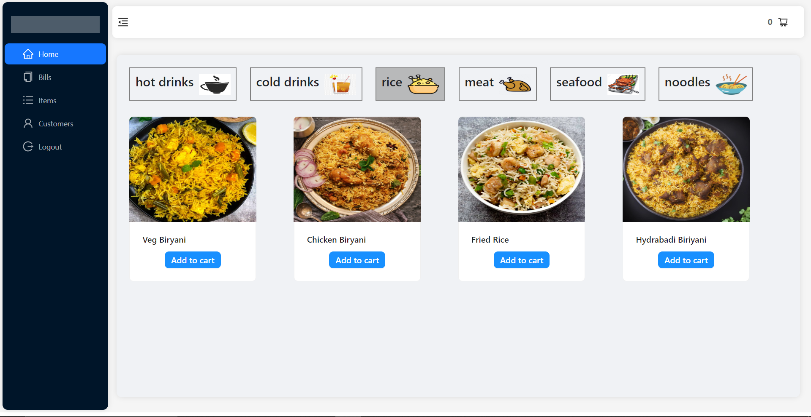
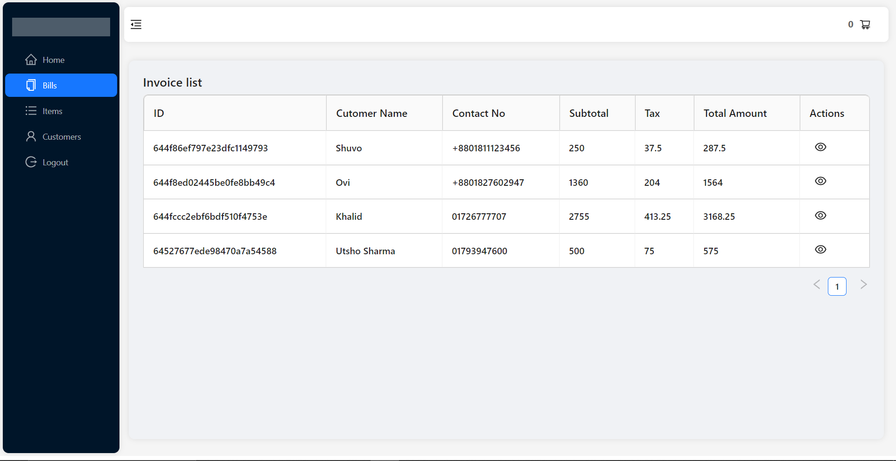
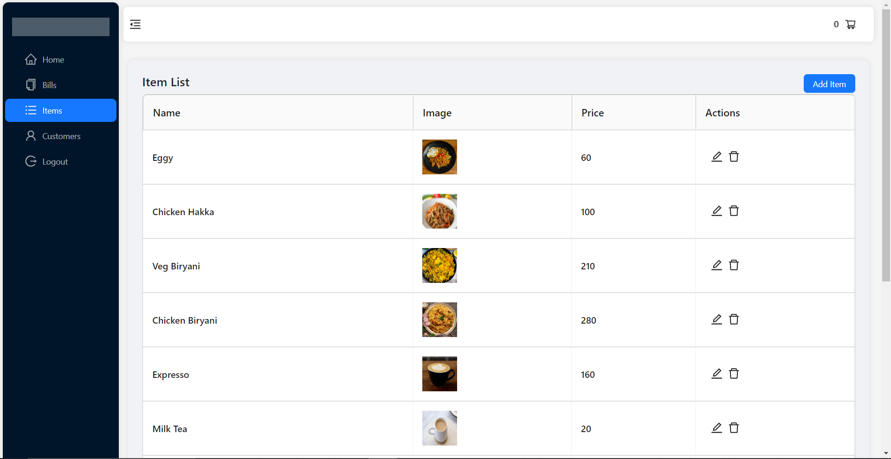
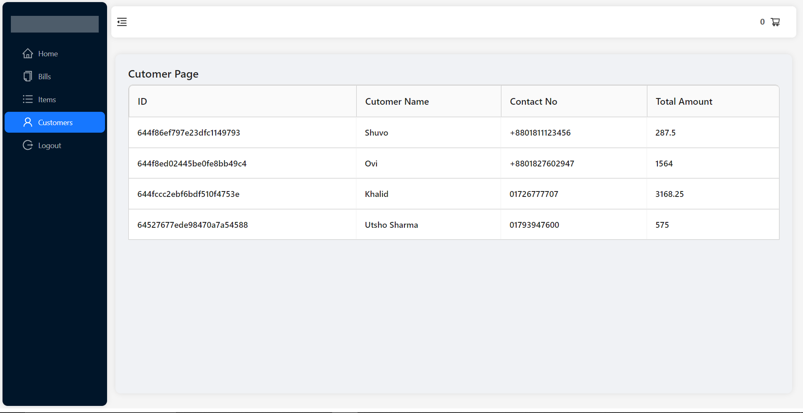
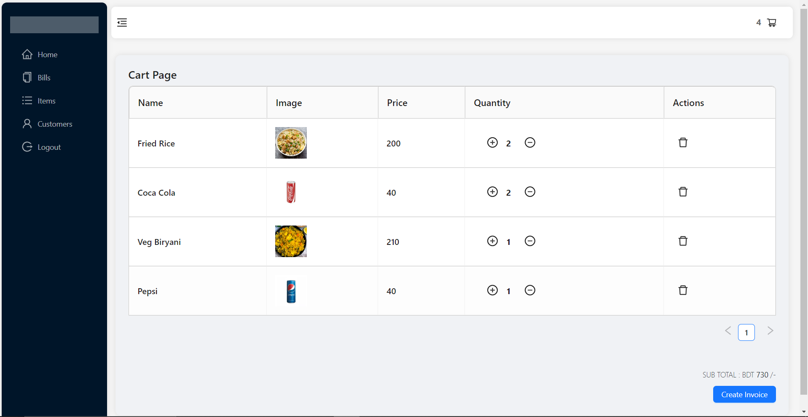

# POSView

POSView is a web application built using the MERN stack, which includes MongoDB, Express, React, and Node.js. This application is designed to serve as a point of sale (POS) system, allowing users to manage products, customers, and sales.

## Project View

- **Homepage**

  

- **Bills**

  

- **Items**

  

- **Add New Item**

  

- **Customers**

  

- **Cart**

  

- **Invoice**

  

## Installation

- Clone the project from the GitHub repository: 

       git clone https://github.com/OviSarkar62/POSView.git
    
- Navigate to the project directory: 

       cd POSView
    
- Install the dependencies for the server: 

       npm install express dotenv cors colors body-parser bcrypt joi mongoose morgan nodemon zxcvbn
    
- Navigate to the client directory: 

       cd client
    
- Install the dependencies for the client: 

       npm install react-router-dom react-redux redux redux-thunk axios antd 
    
- Create a .env file in the root directory with the following environment variables:

       DB_URL = mongodb+srv://<user>:<pass>@cluster0.l17quyr.mongodb.net/database

       SALT_ROUNDS = 10

- Start the server: 

       node index.js
    
- In a new terminal window, navigate to the client directory:

       cd client
    
- Start the client: 

       npm start
    
- Access the application. Open your web browser and visit http://localhost:3000 to access the application.

## Client-side functionality

The client-side of the application is built with React. The user interface provides the following functionality:

- View a list of all products, customers, and sales
- Create a new product, customer, or sale
- Edit an existing product, customer, or sale
- Delete a product, customer, or sale

The client utilizes Axios to make HTTP requests to the server-side API.

## Stack

- MongoDB - NoSQL database for storing data
- Express - Backend framework for building RESTful APIs
- React - Frontend framework for building user interfaces
- Node.js - JavaScript runtime environment for building scalable server-side applications
- Bcrypt - Password hashing library for secure password storage

## Live Link
The live project: [POSView](https://pos-view.vercel.app/login)

